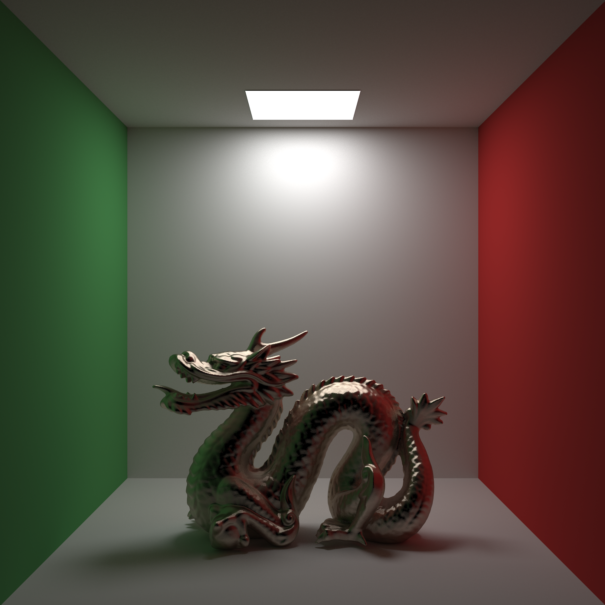

Rendering samples of [pbrt-rust](https://github.com/w3ntao/pbrt-rust).

Ray Tracing In One Weekend final scene with dragon (3840x2160, 1936 samples per pixel):

Cornell box with glass ball (2160x2160, 1936 samples per pixel):

Cornell box with metal dragon (2160x2160, 1936 samples per pixel):

smallpt scene from [Kevin Beason](https://www.kevinbeason.com/smallpt/) (4096x3048, 1936 samples per pixel):

