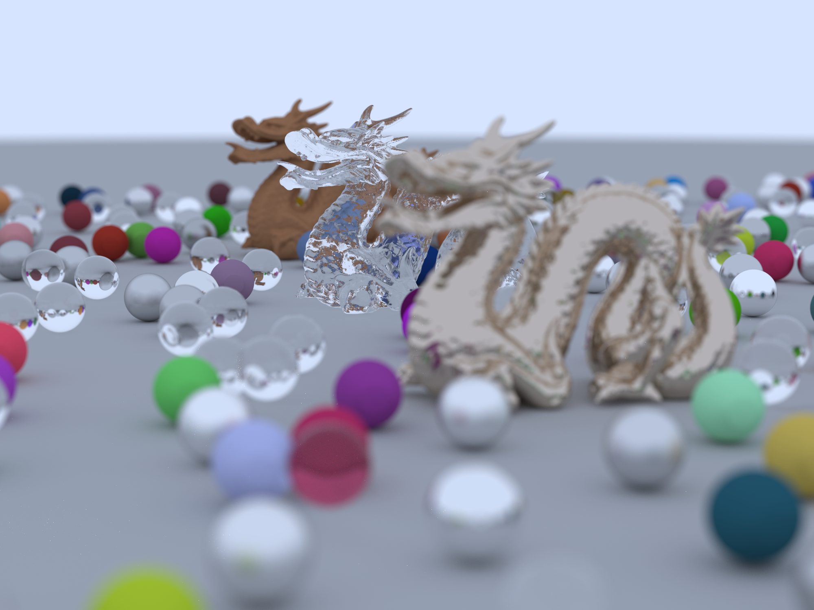

Rendering samples of [pbrt-rust](https://github.com/w3ntao/pbrt-rust).

Ray Tracing In One Weekend final scene with dragon (2000x1500, 1936 samples per pixel):

Cornell box with metal dragon (2000x2000, 1936 samples per pixel):

smallpt scene from [Kevin Beason](https://www.kevinbeason.com/smallpt/) (2048x1524, 1936 samples per pixel):

